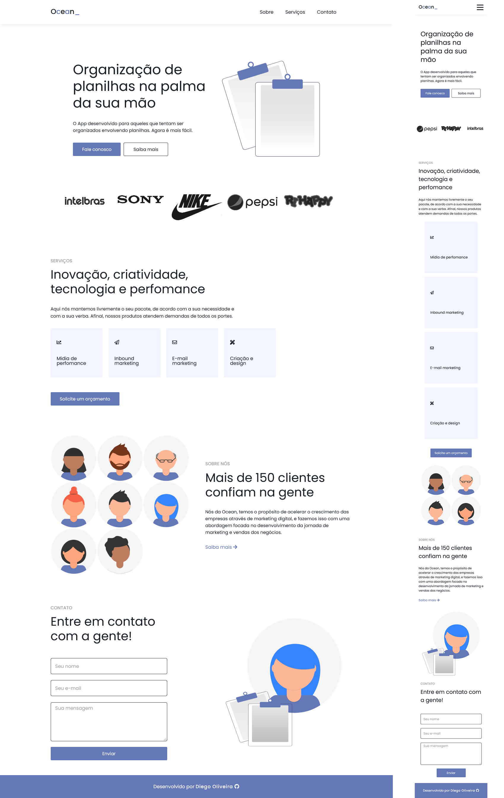

<p align='center'></p>
<h1 align='center'>Desafio Road to Dev Jr - Ocean</h1>
<p align='center'>


</p>

<h3>🔖 Descrição</h3>
<p>Projeto desenvolvido durante o Desafio Road to Dev Jr. oferecida pelos amigos Luciano Gomes e Caio Augusto. O Desafio Road to Dev Jr é uma experiência incrivel, que nos desafia a ir alem dos nossos conhecimentos.<p>

<p>Ocean Briefing - 'Opa, beleza ? recentemente criamos um App que auxilia na criação de planilhas, porém sentimos que ainda está faltando algo para nos ajudar na divulgação do produto, estamos precisando de uma página, única mesmo, gostamos do padrão clean e minimalista, sem exageros ou cores extravagantes. Nossa equipe desenvolveu o layout e precisamos que você o programe para nós, existem alguns detalhes que não abrimos mão. Primeiro, a página deve ser feito em âncora , com scroll suave ao alterar as guias. Segundo, deve conter também alguma animação, talvez nas box de serviços, mas isso deixo na sua criatividade. Ah, outra coisa, nosso App também funciona como PWA, então precisamos que essa página seja totalmente responsiva, pois teremos acessos de todas as plataformas."
<p>

<h3>🚀 Tecnologias</h3>
<ul>
    <li>Html</li>
    <li>Css</li>
    <li>Sass</li>
    <li>Javascript Vanilla</li>
    <li>Jquery</li>
</ul>

<h3>ℹ️ Como usar</h3>

<h4>ℹ️ Pré-requisitos</h4>

<ul>
    <li><a href="" target="_blank">Git</a></li>
</ul>

<h4>ℹ️ Rodando Projeto</h4>

```bash

# Clone o repositório
$ git clone https://github.com/Diegooliveyra/Ocean-Road-to-Dev.git

# Acesse a pasta do projeto no terminal
$ cd src/

# Execute o arquivo
$ index.html

```

<h3>🖼 Layout</h3>


<h3>📝 Licença</h3>
<p>O projeto se encontra sob licença MIT. Para mais detalhes, acesse <a href='LICENSE'>license<a>.</p>
<p>Criado com 💙 por <a href='https://github.com/Diegooliveyra/' target='blank'>Diego Oliveira</a></p>
